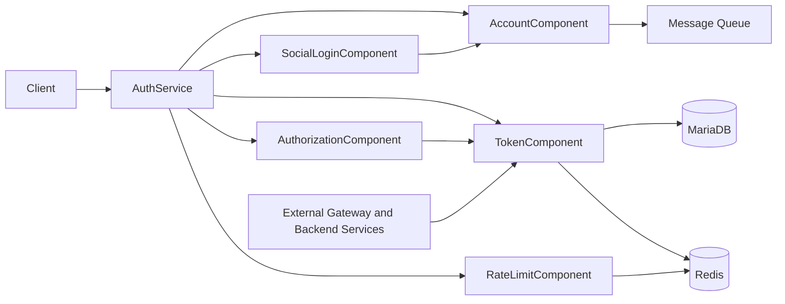

# Component Dependencies

## 의존성 매트릭스

| 컴포넌트 | 의존 대상 | 통신 방식 |
|---|---|---|
| `AuthService` | 모든 컴포넌트 | 인프로세스 메서드 호출 (동기) |
| `SocialLoginComponent` | `AccountComponent` | 인프로세스 메서드 호출 (계정 조회/생성) |
| `AccountComponent` | (메시지 큐) | 이메일 발송 이벤트 발행만 (Q5:B — consumer는 이 프로젝트 범위 밖) |
| `AuthorizationComponent` | `TokenComponent` | 인프로세스 메서드 호출 (역할 클레임 조회) |
| `RateLimitComponent` | 없음 (Redis 직접 사용) | Redis 클라이언트 |
| `TokenComponent` | 없음 | MariaDB(Refresh Token 메타데이터) + Redis(블랙리스트) 직접 사용 |
| 외부 (별도 API 게이트웨이 / 다른 백엔드 서비스) | `TokenComponent.validate()` | 이 서비스가 노출하는 토큰 검증 API (HTTP, 프로세스 외부) |

모든 컴포넌트는 이 서비스 내부에서 인프로세스로 통신한다(단일 배포 단위, Q1 결정). 외부와의 유일한 통신 지점은 (a) 클라이언트가 직접 호출하는 REST API, (b) 이메일 발송 이벤트 발행, (c) 외부 서비스가 호출하는 토큰 검증 API다.

## 통신 패턴 다이어그램

### Mermaid



### 텍스트 대체 표현

```
Client
  -> AuthService
       -> AccountComponent -> Message Queue (email events)
       -> SocialLoginComponent -> AccountComponent
       -> TokenComponent -> MariaDB, Redis
       -> RateLimitComponent -> Redis
       -> AuthorizationComponent -> TokenComponent

External Gateway / Backend Services -> TokenComponent.validate() (외부 HTTP 호출)
```

## 참고: 제거된 의존성

- ~~`GatewayRoutingComponent` -> 백엔드 마이크로서비스 (프록시)~~ — API 게이트웨이가 별도 프로젝트로 결정되어 2026-07-31 제거.
