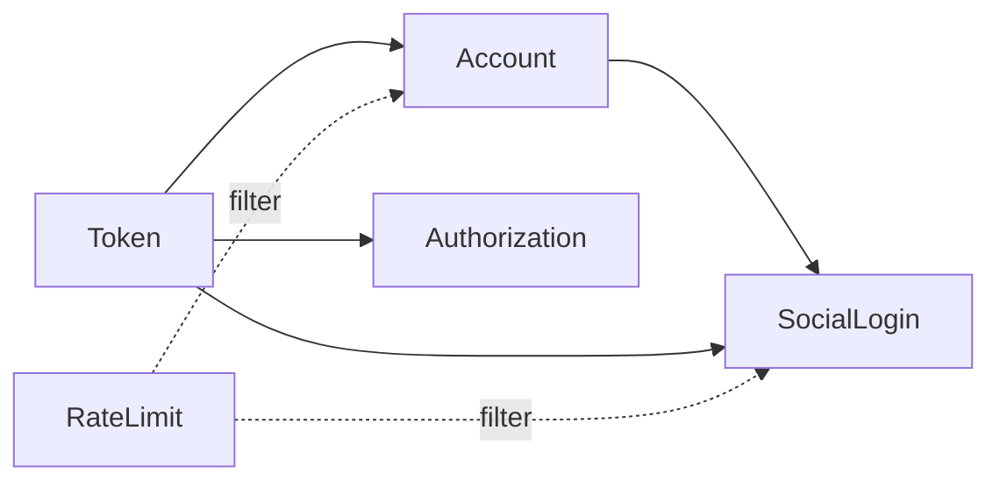

# Unit of Work Dependencies

## 의존성 매트릭스

| Unit | 의존 대상 Unit | 의존 이유 |
|---|---|---|
| Token | 없음 | 기반 Unit |
| Account | Token | 비밀번호 재설정 시 Refresh Token 전체 무효화 |
| SocialLogin | Account, Token | 계정 조회/생성(Account), 로그인 성공 시 토큰 발급(Token) |
| RateLimit | 없음 | Redis 직접 사용, 다른 Unit의 엔드포인트 앞에 필터로 결합(런타임 결합이지 컴파일 타임 의존이 아님) |
| Authorization | Token | 역할 클레임 조회 |

## 다이어그램

### Mermaid



### 텍스트 대체 표현

```
Token (기반, 의존 없음)
  -> Account (Token에 의존)
       -> SocialLogin (Account, Token에 의존)
  -> Authorization (Token에 의존)

RateLimit (독립적, Account/SocialLogin 엔드포인트에 필터로 결합 — 코드 의존 아님)
```

## 구축 순서와의 관계

의존성 매트릭스는 `unit-of-work.md`의 권장 구축 순서(Token → Account → SocialLogin → RateLimit → Authorization)와 일치한다: 각 Unit은 자신이 의존하는 Unit이 먼저 구축된 뒤에 착수한다. RateLimit은 코드 의존성이 없어 순서상 유연하지만, 인증 플로우가 먼저 존재해야 필터를 검증할 수 있어 4번째로 배치했다.
