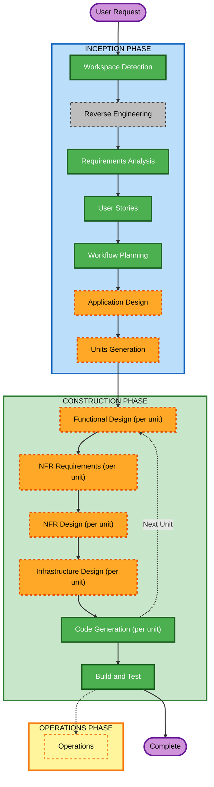

# Execution Plan

## Detailed Analysis Summary

### Change Impact Assessment
- **User-facing changes**: Yes — signup, email verification, login (password + 3 social providers), password reset, logout, and every downstream API call (all routed through this service as gateway).
- **Structural changes**: Yes — this is the first service in the platform; it establishes the auth/authz model AND the API-gateway routing pattern every future microservice will plug into.
- **Data model changes**: Yes — new entities: User, Role, RefreshToken (with rotation/family tracking), SocialAccount (per-provider link). Redis-side structures: access-token blacklist, rate-limit counters, IP-block keys — not relational, but part of the data design.
- **API changes**: Yes — all new: signup, email verification, login, social login (x3), token refresh, logout, password reset, plus the gateway's generic proxy/routing path.
- **NFR impact**: Yes — Security Baseline is enabled as a blocking constraint (NFR-04); horizontal scalability requires Redis-backed shared state for rate-limit/blacklist (NFR-03); Property-Based Testing applies in partial mode to token/serialization logic (NFR-06).

### Risk Assessment
- **Risk Level**: Medium — high technical complexity (refresh-token rotation + reuse detection, 3 independent OAuth2 provider integrations, distributed rate limiting, gateway routing) offset by greenfield context (no existing users or production traffic; a full rollback just means discarding this branch).
- **Rollback Complexity**: Easy (greenfield, nothing in production yet)
- **Testing Complexity**: Complex (many integrated security-sensitive flows: token rotation/reuse, multi-provider OAuth2, distributed rate limiting)

## Workflow Visualization



### Text Alternative
```
INCEPTION
- Workspace Detection: COMPLETED
- Reverse Engineering: SKIPPED (greenfield, nothing to reverse-engineer)
- Requirements Analysis: COMPLETED
- User Stories: COMPLETED (21 stories / 4 personas)
- Workflow Planning: COMPLETED (this document)
- Application Design: EXECUTE
- Units Generation: EXECUTE

CONSTRUCTION (per unit, once units are defined)
- Functional Design: EXECUTE
- NFR Requirements: EXECUTE
- NFR Design: EXECUTE
- Infrastructure Design: EXECUTE
- Code Generation: EXECUTE (always)
- Build and Test: EXECUTE (always, after all units complete)

OPERATIONS
- Operations: PLACEHOLDER (not run in this workflow version)
```

## Phases to Execute

### INCEPTION PHASE
- [x] Workspace Detection (COMPLETED)
- [x] Reverse Engineering (SKIPPED — greenfield, no existing business logic)
- [x] Requirements Analysis (COMPLETED)
- [x] User Stories (COMPLETED)
- [x] Workflow Planning (IN PROGRESS — this document)
- [ ] Application Design — **EXECUTE**
  - **Rationale**: This service bundles several distinct concerns (auth core, token lifecycle, social login, RBAC, rate-limit/IP-block, gateway routing) that need explicit component boundaries and method-level responsibilities defined before decomposition into units — skipping this would leave component dependencies (e.g., "does Login call RateLimit or does RateLimit wrap the endpoint?") undecided going into Construction.
- [ ] Units Generation — **EXECUTE**
  - **Rationale**: The requirements/stories span 6 Epics with materially different technical shapes (relational CRUD, distributed cache/rate-limiting, OAuth2 integration x3, JWT crypto, reverse-proxy routing). This is too large and heterogeneous for a single undifferentiated implementation pass — decomposing into units lets each get the design depth (and NFR treatment) it actually needs.

### CONSTRUCTION PHASE
*(Executed per-unit once Units Generation defines the units; stage-level defaults below, re-assessed per unit per core-workflow.md)*
- [ ] Functional Design — **EXECUTE** (default) — most units involve new data models and non-trivial business rules (rotation, reuse detection, RBAC checks)
- [ ] NFR Requirements — **EXECUTE** (default) — Security Baseline is a blocking constraint platform-wide; several units have explicit scalability requirements (NFR-03)
- [ ] NFR Design — **EXECUTE** (default) — follows from NFR Requirements being in scope
- [ ] Infrastructure Design — **EXECUTE** (default) — Redis and routing/gateway units need infra-service mapping; simpler CRUD units may end up minimal here, decided per-unit
- [ ] Code Generation — EXECUTE (ALWAYS)
  - **Rationale**: Implementation planning and code generation needed
- [ ] Build and Test — EXECUTE (ALWAYS)
  - **Rationale**: Build, test, and verification needed

### OPERATIONS PHASE
- [ ] Operations — PLACEHOLDER
  - **Rationale**: Future deployment and monitoring workflows (not part of this workflow version)

## Estimated Timeline
- **Total Phases**: 2 active phases (Inception remainder + Construction), Operations is placeholder
- **Estimated Duration**: Not time-boxed — AI-DLC proceeds in Bolts (hours/days) gated by explicit approval at each stage, not calendar sprints

## Success Criteria
- **Primary Goal**: A working `auth-service` that issues/validates/rotates JWTs, supports email+password and 3-provider social login, enforces RBAC, protects itself with distributed rate-limiting/IP-blocking, and proxies authenticated requests to backend services as the platform's gateway.
- **Key Deliverables**: Application design (components), unit decomposition, per-unit functional/NFR/infra design, generated code + tests, build-and-test instructions.
- **Quality Gates**: Security Baseline compliance (blocking) at every applicable stage; Property-Based Testing (partial) for token/serialization logic; explicit user approval at every stage gate.
